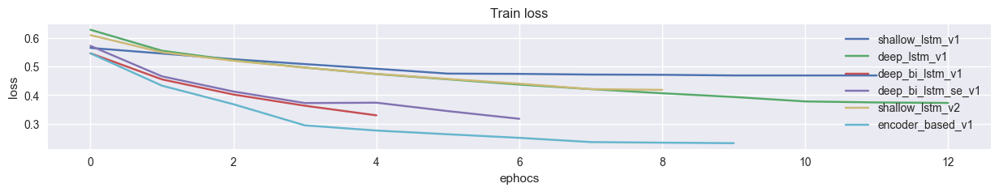

# README - Siamese Network for Duplicate Question Detection

## 📌 Project Overview

This project implements multiple **Siamese Network architectures** to detect duplicate questions using the **Quora
Question Pairs dataset**.
It leverages **word embeddings (GloVe 100d)**, **LSTM/ BiLSTM/ CNN/ Transformer-based feature extractors**, and provides
evaluation with visualization, class balancing, and deployment-ready models.

---

## ⚙️ Steps Taken

### 1. Environment Setup

* Imported all required libraries: `tensorflow`, `keras`, `sklearn`, `matplotlib`, `seaborn`, `pandas`, `numpy`,
  `gradio`, etc.
* Defined constants:

    * `SENTENCE_MAX_WORDS_LEN = 35`
    * `EMBEDDING_DIM = 100`
    * Training params: `EPOCHS=20`, `BATCH_SIZE=1012`.

---

### 2. Data Collection

* Downloaded **Quora Duplicate Questions dataset** using `kagglehub`.
* Downloaded **GloVe 100d embeddings**.
* Loaded dataset and performed initial exploration (`head`, `info`, `describe`, duplicates, missing values).

---

### 3. Data Preprocessing

* Cleaned text using regex:

    * Lowercasing, removing symbols.
    * Added spacing between numbers & text (e.g., `12cm → 12 cm`).
* Removed **NaN values** and **duplicates**.
* Applied **max length filtering** (≤ 35 words).
* Tokenized questions using `Tokenizer`.
* Converted tokens to **padded sequences** (`pad_sequences`).
* Saved tokenizer for deployment.

---

### 4. Embedding Matrix

* Loaded **GloVe embeddings**.
* Created **embedding matrix** with pre-trained vectors for known words.
* Randomly initialized vectors for OOV words.
* Applied **PCA projection** for visualization.

---

### 5. Dataset Splits

* Split into **Train / Validation / Test** sets with ratios:

    * Train: 60%
    * Val: 20%
    * Test: 20%
* Applied **class weights** to handle imbalanced classes.

---

### 6. Model Architectures

Implemented 6 different models inside a **Siamese Framework**:

1. **Shallow LSTM v1** – Embedding + LSTM + Dense.
2. **Deep LSTM v1** – Stacked LSTMs + CNN layers.
3. **Deep BiLSTM v1** – Bidirectional LSTM + CNN layers.
4. **Deep BiLSTM + SE v1** – BiLSTM + CNN + Squeeze-Excitation.
5. **Shallow LSTM v2** – LSTM + Dense + BatchNorm + LeakyReLU.
6. **Encoder-based v1** – Transformer-style encoder (Embedding + Positional Encoding + Multi-Head Attention + FFN).

Each model is wrapped in a **CustomModel class** for:

* Training with callbacks (`EarlyStopping`, `ModelCheckpoint`, `ReduceLROnPlateau`).
* Loading cached weights & history.
* Automatic evaluation & saving.

---

### 7. Training & History

* Trained each model with **balanced class weights**.
* Stored history (`loss`, `accuracy`, `val_loss`, `val_accuracy`) in cache.
* Visualized training & validation curves.

---

### 8. Evaluation

* Evaluated each model on **Train, Validation, and Test sets**.
* Exported metrics (`loss`, `accuracy`) into `model_results.csv`.
* Plotted per-model comparison charts.

---

### 9. Deployment

* Implemented **Gradio App** for interactive predictions:

    * Select model from dropdown.
    * Input two sentences.
    * Output: Prediction (duplicate or not) with probability.
* Saved each model in `.keras` format for production use.
* Saved tokenizer in `x_tokenizer.pkl`.

---

## 📊 Results

* Each model’s performance (Train, Val, Test) is recorded in `deployments/model_results.csv`.
* Visualization plots show **learning curves** for better model comparison.

---

## 🖼️ Image References

Below are paths where screenshots/plots can be placed:

### Dataset Distribution

### Question Length Distribution

### PCA Word Embeddings

### Model Architectures

* 
* 
* 
* 
* 
* 

### Training Loss Comparison

### Validation Loss Comparison

### Training Accuracy Comparison

### Validation Accuracy Comparison

### Train Summary

### GUI

* 
* 
* 
* 